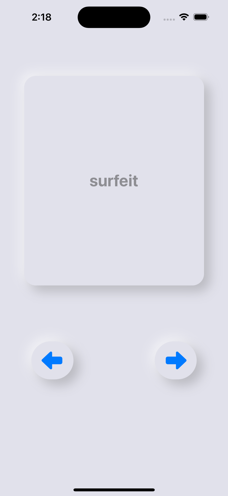
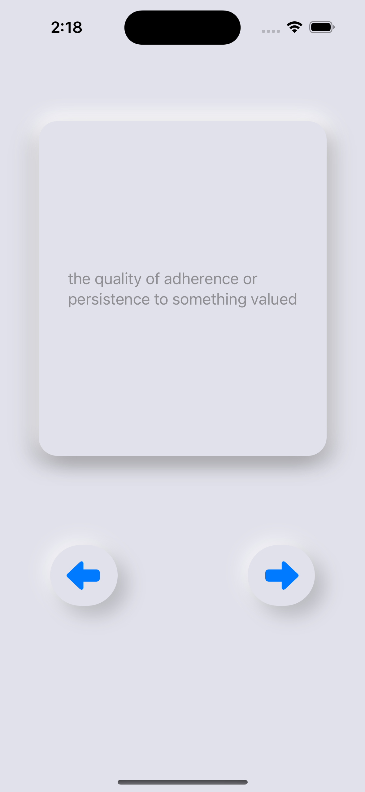

# FlashCard App
As the very creative name suggests, it's an iOS flashcard app that I built using SwiftUI to train my vocabulary, for my GRE exam. You can flip the cards to see their back sides, navigate through the cards, and study at your own pace.

## Description
It has an extremely simple UI, I've used, my favourite, UI style, a Neumorphic design. It has about 700 or so words in a array and it traverses it randomly. The intention behind having it traverse randomly is to avoid the Positioning Effect.

### What is Positioning Effect?
Experiments show that when participants are presented with a list of words, they tend to remember the first few and last few words and are more likely to forget those in the middle of the list.

This is known as the serial position effect. The tendency to recall earlier words is called the primacy effect; the tendency to recall later words is called the recency effect.

## Features
- Interactive flashcards with front and back content. 
- Tap to flip the flashcards and reveal the back side. 
- Navigate through flashcards using intuitive navigation buttons. 
- Flashcards are randomised each time you open the app. 
- Start on a random flashcard each time the app is launched.

## Screenshots
 


## Getting Started

### Prerequisites
- Xcode installed (minimum version: Xcode 14.3.1) 
- iOS device or simulator running iOS 16.4 or later

### Installation 
1. Clone the repository: 
```bash
git clone https://github.com/techtheseus/FlashCards.git
```
2. Open the project in Xcode:
```bash
cd FlashCards
open FlashCards.xcodeproj
```
3. Build and run the project in Xcode.

## Usage
1. Open the app on your iOS device or simulator.
2. Tap on a flashcard to flip it and reveal its back side.
3. Use the navigation buttons to move through the flashcards.
4. Enjoy studying with randomised flashcards!

## Contributing
Contributions are welcome! If you find any bugs or have suggestions for improvements, please open an issue or submit a pull request. For major changes, please open an issue first to discuss the changes you would like to make.

Made with ❤️ by [whybhav](https://github.com/techtheseus)